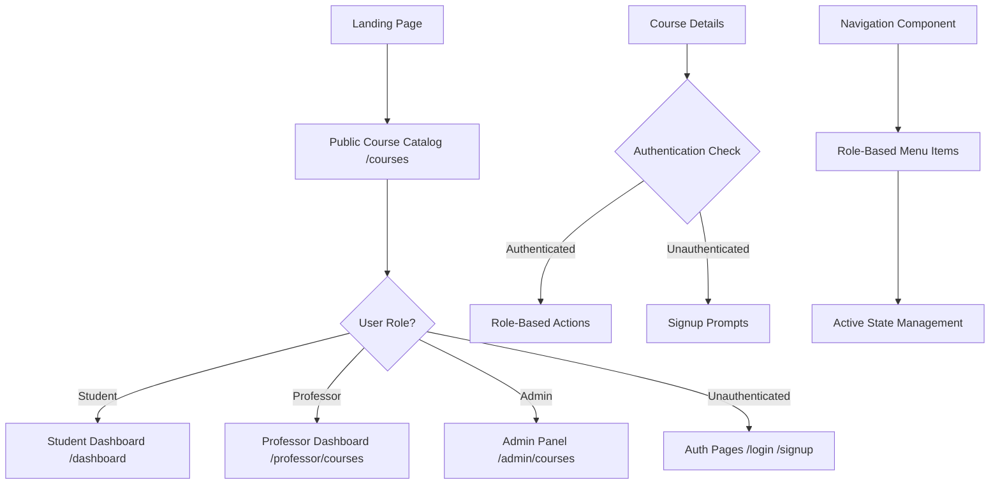
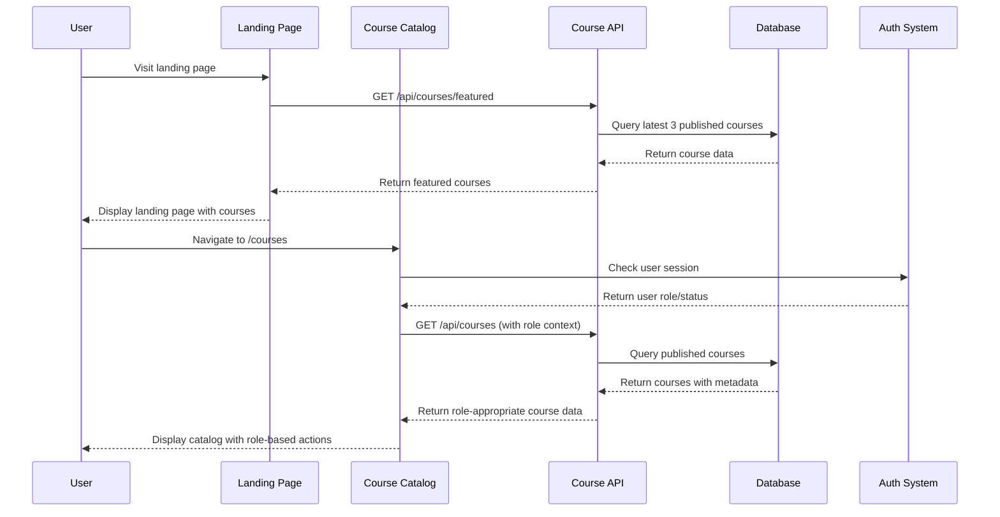

# Design Document

## Overview

This design implements a comprehensive course access system with role-based interfaces and an enhanced landing page featuring course showcases. The architecture leverages Next.js App Router with server-side rendering for optimal performance and SEO, while maintaining clear separation of concerns between different user roles.

## Architecture

### High-Level Architecture



### Data Flow Architecture



## Components and Interfaces

### 1. Landing Page Enhancement

**File:** `src/app/page.tsx`

**Key Features:**
- Hero section with platform value proposition
- Featured courses section (3 most recent)
- Call-to-action sections
- SEO optimization with proper meta tags

**Component Structure:**
```typescript
interface FeaturedCourse {
  id: string;
  title: string;
  description: string;
  thumbnailUrl: string;
  professor: {
    name: string;
  };
  category: {
    name: string;
  };
  enrollmentCount: number;
  price: number | null;
  currency: string;
}

interface LandingPageProps {
  featuredCourses: FeaturedCourse[];
}
```

### 2. Public Course Catalog

**File:** `src/app/courses/page.tsx`

**Key Features:**
- Server-side rendered course list
- Role-based action buttons
- Search and filtering capabilities
- Responsive grid layout
- Pagination support

**Component Structure:**
```typescript
interface CourseCardProps {
  course: Course;
  userRole?: UserRole;
  isEnrolled?: boolean;
  userActions: {
    canEnroll: boolean;
    canEdit: boolean;
    canManage: boolean;
    isOwner: boolean;
  };
}

interface CourseCatalogProps {
  courses: Course[];
  userRole?: UserRole;
  enrolledCourseIds: string[];
  totalPages: number;
  currentPage: number;
}
```

### 3. Role-Based Navigation

**File:** `src/components/navigation/main-nav.tsx`

**Key Features:**
- Dynamic menu items based on user role
- Active state management
- Responsive mobile menu
- Consistent styling across roles

**Component Structure:**
```typescript
interface NavigationItem {
  href: string;
  label: string;
  icon?: React.ComponentType;
  isActive?: boolean;
  requiresAuth?: boolean;
  allowedRoles?: UserRole[];
}

interface MainNavProps {
  user?: {
    role: UserRole;
    name: string;
  };
  currentPath: string;
}
```

### 4. Course Action Components

**File:** `src/components/course/course-actions.tsx`

**Key Features:**
- Role-specific action buttons
- Loading states and error handling
- Consistent styling and behavior
- Accessibility compliance

**Component Structure:**
```typescript
interface CourseActionsProps {
  courseId: string;
  userRole?: UserRole;
  isEnrolled?: boolean;
  isOwner?: boolean;
  onEnroll?: () => void;
  onContinue?: () => void;
  onEdit?: () => void;
  onManage?: () => void;
}
```

## Data Models

### Enhanced Course Model (API Response)

```typescript
interface CourseWithMetadata {
  id: string;
  title: string;
  description: string;
  thumbnailUrl: string;
  price: number | null;
  currency: string;
  isPublished: boolean;
  
  category: {
    id: string;
    name: string;
    slug: string;
  };
  
  professor: {
    id: string;
    name: string;
    expertise: string[];
  };
  
  lessons: {
    id: string;
    title: string;
    duration: number;
  }[];
  
  // Computed metadata
  enrollmentCount: number;
  totalDuration: number; // in minutes
  lessonCount: number;
  averageRating: number;
  reviewCount: number;
  
  // User-specific data (when authenticated)
  isEnrolled?: boolean;
  progress?: number;
  lastAccessedAt?: Date;
  canEdit?: boolean;
  canManage?: boolean;
}
```

### Navigation Configuration

```typescript
interface NavigationConfig {
  [key in UserRole]: NavigationItem[];
}

const navigationConfig: NavigationConfig = {
  STUDENT: [
    { href: '/dashboard', label: 'My Courses', icon: BookOpen },
    { href: '/courses', label: 'Browse Courses', icon: Search },
    { href: '/certificates', label: 'Certificates', icon: Award }
  ],
  PROFESSOR: [
    { href: '/professor', label: 'Dashboard', icon: BarChart },
    { href: '/professor/courses', label: 'My Courses', icon: BookOpen },
    { href: '/courses', label: 'Course Catalog', icon: Search }
  ],
  ADMIN: [
    { href: '/admin', label: 'Dashboard', icon: Settings },
    { href: '/admin/courses', label: 'Manage Courses', icon: BookOpen },
    { href: '/admin/users', label: 'Manage Users', icon: Users },
    { href: '/courses', label: 'Course Catalog', icon: Search }
  ]
};
```

## Error Handling

### API Error Responses

```typescript
interface APIError {
  error: string;
  code?: string;
  details?: Record<string, any>;
}

// Standard error responses
const errorResponses = {
  UNAUTHORIZED: { error: 'Authentication required', code: 'AUTH_REQUIRED' },
  FORBIDDEN: { error: 'Access denied', code: 'ACCESS_DENIED' },
  NOT_FOUND: { error: 'Course not found', code: 'COURSE_NOT_FOUND' },
  SERVER_ERROR: { error: 'Internal server error', code: 'SERVER_ERROR' }
};
```

### Client-Side Error Handling

```typescript
interface ErrorBoundaryState {
  hasError: boolean;
  error?: Error;
  errorInfo?: ErrorInfo;
}

// Error fallback components for different scenarios
const errorFallbacks = {
  CourseLoadError: () => <CourseLoadErrorFallback />,
  NetworkError: () => <NetworkErrorFallback />,
  AuthError: () => <AuthErrorFallback />
};
```

## Testing Strategy

### Unit Testing

**Components to Test:**
- Course card rendering with different user roles
- Navigation menu generation based on user role
- Action button visibility and behavior
- Featured course display on landing page

**Test Cases:**
```typescript
describe('CourseCard', () => {
  it('shows enroll button for unauthenticated users');
  it('shows continue button for enrolled students');
  it('shows edit button for course owners');
  it('shows manage button for admins');
  it('handles loading states correctly');
});

describe('Navigation', () => {
  it('renders student navigation for student role');
  it('renders professor navigation for professor role');
  it('renders admin navigation for admin role');
  it('highlights active navigation items');
});
```

### Integration Testing

**API Endpoints to Test:**
- `/api/courses/featured` - Featured courses for landing page
- `/api/courses` - Public course catalog with role-based data
- `/api/courses/[id]` - Course details with user-specific actions

**Test Scenarios:**
```typescript
describe('Course API Integration', () => {
  it('returns featured courses for landing page');
  it('returns role-appropriate course data');
  it('handles pagination correctly');
  it('applies filters and search correctly');
  it('returns proper error responses');
});
```

### End-to-End Testing

**User Flows to Test:**
1. Visitor → Landing page → Course catalog → Signup → Enrollment
2. Student → Login → Dashboard → Course catalog → Enrollment
3. Professor → Login → Course management → Public catalog view
4. Admin → Login → Course administration → Public catalog oversight

## Performance Optimization

### Server-Side Rendering

- Landing page: Static generation with ISR (revalidate every hour)
- Course catalog: Server-side rendering with caching
- Course details: Static generation for published courses

### Caching Strategy

```typescript
// API route caching configuration
const cacheConfig = {
  '/api/courses/featured': { revalidate: 3600 }, // 1 hour
  '/api/courses': { revalidate: 1800 }, // 30 minutes
  '/api/courses/[id]': { revalidate: 3600 } // 1 hour
};
```

### Image Optimization

- Use Next.js Image component for all course thumbnails
- Implement responsive image sizes
- Add proper alt text for accessibility
- Use WebP format with fallbacks

### Database Optimization

```sql
-- Indexes for course queries
CREATE INDEX idx_courses_published ON courses(is_published, created_at DESC);
CREATE INDEX idx_courses_category ON courses(category_id, is_published);
CREATE INDEX idx_enrollments_user_course ON enrollments(user_id, course_id);
```

## Security Considerations

### Access Control

- Server-side role validation for all course operations
- Proper authentication checks before showing role-specific actions
- CSRF protection for all form submissions
- Rate limiting for public API endpoints

### Data Sanitization

```typescript
// Input validation for course queries
const courseQuerySchema = z.object({
  page: z.number().min(1).max(100).optional(),
  category: z.string().uuid().optional(),
  search: z.string().max(100).optional(),
  sort: z.enum(['newest', 'popular', 'rating']).optional()
});
```

### Content Security

- Validate all course thumbnails and content
- Sanitize user-generated content in reviews
- Implement proper CORS policies
- Use HTTPS for all course-related operations