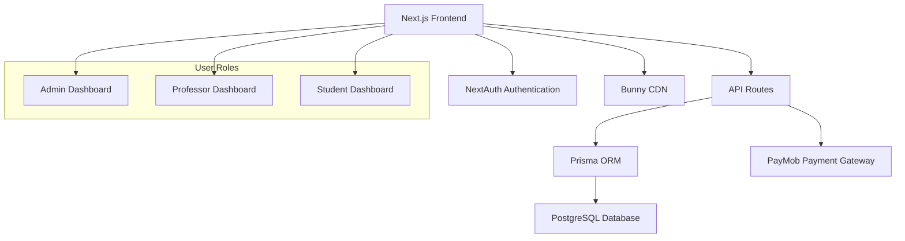

# Design Document

## Overview

This design transforms the existing Egyptian math teacher platform into a comprehensive multi-category educational platform. The system will support three user roles (Admin, Professor, Student), multiple course categories, integrated PayMob payment system, and enhanced analytics while maintaining the existing Next.js 15 + TypeScript + Prisma architecture.

## Architecture

### High-Level Architecture



### Technology Stack
- **Frontend**: Next.js 15, TypeScript, Tailwind CSS, Shadcn/ui
- **Authentication**: NextAuth.js v5
- **Database**: PostgreSQL with Prisma ORM
- **Payment**: PayMob Egyptian Payment Gateway
- **Media**: Bunny CDN for video streaming
- **UI**: Radix UI components with Arabic RTL support

## Components and Interfaces

### 1. Database Schema Design

#### Enhanced User Model
```typescript
model User {
  id          String    @id @default(cuid())
  email       String?   @unique
  phone       String    @unique
  name        String
  password    String
  role        UserRole  @default(STUDENT)
  isActive    Boolean   @default(true)
  
  // Professor-specific fields
  bio         String?
  expertise   String[]  // Array of expertise areas
  
  // Student-specific fields
  parentPhone String?
  
  enrollments     Enrollment[]
  ownedCourses    Course[]     @relation("ProfessorCourses")
  payments        Payment[]
  viewingHistory  ViewingHistory[]
  
  createdAt   DateTime @default(now())
  updatedAt   DateTime @updatedAt
}

enum UserRole {
  ADMIN
  PROFESSOR
  STUDENT
}
```

#### Category System
```typescript
model Category {
  id          String @id @default(cuid())
  name        String @unique
  description String
  iconUrl     String?
  slug        String @unique
  isActive    Boolean @default(true)
  
  courses     Course[]
  
  createdAt   DateTime @default(now())
  updatedAt   DateTime @updatedAt
}
```

#### Enhanced Course Model
```typescript
model Course {
  id              String      @id @default(cuid())
  title           String
  description     String
  thumbnailUrl    String
  price           Decimal?    // null for free courses
  currency        String      @default("EGP")
  isPublished     Boolean     @default(false)
  bunnyLibraryId  String
  
  categoryId      String
  category        Category    @relation(fields: [categoryId], references: [id])
  
  professorId     String
  professor       User        @relation("ProfessorCourses", fields: [professorId], references: [id])
  
  lessons         Lesson[]
  enrollments     Enrollment[]
  payments        Payment[]
  
  createdAt       DateTime    @default(now())
  updatedAt       DateTime    @updatedAt
  
  @@index([categoryId])
  @@index([professorId])
}
```

#### Payment System
```typescript
model Payment {
  id              String        @id @default(cuid())
  amount          Decimal
  currency        String        @default("EGP")
  status          PaymentStatus @default(PENDING)
  paymentMethod   String?
  
  // PayMob specific fields
  paymobOrderId   String?       @unique
  paymobTxnId     String?
  
  userId          String
  user            User          @relation(fields: [userId], references: [id])
  
  courseId        String
  course          Course        @relation(fields: [courseId], references: [id])
  
  createdAt       DateTime      @default(now())
  updatedAt       DateTime      @updatedAt
  
  @@index([userId])
  @@index([courseId])
}

enum PaymentStatus {
  PENDING
  COMPLETED
  FAILED
  REFUNDED
}
```

#### Enhanced Analytics
```typescript
model ViewingHistory {
  id              String   @id @default(cuid())
  userId          String
  user            User     @relation(fields: [userId], references: [id])
  
  lessonId        String
  lesson          Lesson   @relation(fields: [lessonId], references: [id])
  
  watchedDuration Int      // in seconds
  totalDuration   Int      // in seconds
  lastPosition    Int      // in seconds for resume functionality
  completed       Boolean  @default(false)
  
  createdAt       DateTime @default(now())
  updatedAt       DateTime @updatedAt
  
  @@unique([userId, lessonId])
  @@index([userId])
  @@index([lessonId])
}
```

### 2. API Design

#### Authentication API
- `POST /api/auth/signin` - User login
- `POST /api/auth/signup` - Student registration
- `POST /api/auth/signout` - User logout

#### Category Management API
- `GET /api/categories` - List all active categories
- `POST /api/categories` - Create category (Admin only)
- `PUT /api/categories/[id]` - Update category (Admin only)
- `DELETE /api/categories/[id]` - Delete category (Admin only)

#### Course Management API
- `GET /api/courses` - List courses with filtering
- `POST /api/courses` - Create course (Professor/Admin)
- `PUT /api/courses/[id]` - Update course (Owner/Admin)
- `DELETE /api/courses/[id]` - Delete course (Owner/Admin)
- `GET /api/courses/[id]/analytics` - Course analytics (Owner/Admin)

#### Payment API
- `POST /api/payments/initiate` - Initiate PayMob payment
- `POST /api/payments/callback` - PayMob webhook handler
- `GET /api/payments/[id]/status` - Check payment status

#### Analytics API
- `POST /api/analytics/viewing` - Track video viewing progress
- `GET /api/analytics/course/[id]` - Get course analytics
- `GET /api/analytics/student/[id]` - Get student progress

### 3. Component Architecture

#### Shared Components
```typescript
// Category selector component
interface CategorySelectorProps {
  selectedCategory?: string;
  onCategoryChange: (categoryId: string) => void;
  showAll?: boolean;
}

// Course card component
interface CourseCardProps {
  course: Course & {
    category: Category;
    professor: User;
    _count: { enrollments: number };
  };
  showPrice?: boolean;
  showEnrollButton?: boolean;
}

// Payment modal component
interface PaymentModalProps {
  course: Course;
  isOpen: boolean;
  onClose: () => void;
  onSuccess: (paymentId: string) => void;
}
```

#### Role-Specific Dashboards

**Admin Dashboard Components:**
- `CategoryManagement` - CRUD operations for categories
- `ProfessorManagement` - Manage professor accounts
- `RevenueAnalytics` - Payment and revenue reports
- `PlatformOverview` - System-wide statistics

**Professor Dashboard Components:**
- `CourseManagement` - Professor's course CRUD
- `StudentAnalytics` - Enrollment and viewing statistics
- `EarningsReport` - Revenue from professor's courses
- `ContentUpload` - Video and material upload interface

**Student Dashboard Components:**
- `EnrolledCourses` - Student's purchased/enrolled courses
- `CourseProgress` - Learning progress tracking
- `PaymentHistory` - Transaction history
- `RecommendedCourses` - Category-based recommendations

## Data Models

### User Roles and Permissions

```typescript
interface RolePermissions {
  ADMIN: {
    categories: ['create', 'read', 'update', 'delete'];
    courses: ['create', 'read', 'update', 'delete'];
    users: ['create', 'read', 'update', 'delete'];
    payments: ['read', 'refund'];
    analytics: ['read_all'];
  };
  PROFESSOR: {
    categories: ['read'];
    courses: ['create', 'read_own', 'update_own', 'delete_own'];
    users: ['read_students'];
    payments: ['read_own'];
    analytics: ['read_own'];
  };
  STUDENT: {
    categories: ['read'];
    courses: ['read_public', 'enroll'];
    users: ['read_own', 'update_own'];
    payments: ['create', 'read_own'];
    analytics: ['read_own'];
  };
}
```

### PayMob Integration Model

```typescript
interface PayMobConfig {
  apiKey: string;
  integrationId: string;
  iframeId: string;
  hmacSecret: string;
  baseUrl: string;
}

interface PayMobOrderRequest {
  amount_cents: number;
  currency: string;
  merchant_order_id: string;
  items: Array<{
    name: string;
    amount_cents: number;
    description: string;
    quantity: number;
  }>;
  billing_data: {
    first_name: string;
    last_name: string;
    email: string;
    phone_number: string;
  };
}
```

## Error Handling

### API Error Response Format
```typescript
interface ApiError {
  success: false;
  error: {
    code: string;
    message: string;
    details?: any;
  };
  timestamp: string;
}

interface ApiSuccess<T> {
  success: true;
  data: T;
  timestamp: string;
}
```

### Error Categories
1. **Authentication Errors** (401, 403)
2. **Validation Errors** (400)
3. **Payment Errors** (402, payment gateway specific)
4. **Resource Not Found** (404)
5. **Server Errors** (500)

### Error Handling Strategy
- Client-side: Toast notifications with user-friendly messages
- Server-side: Structured logging with error tracking
- Payment errors: Specific handling with retry mechanisms
- Network errors: Automatic retry with exponential backoff

## Testing Strategy

### Unit Testing
- **Components**: React Testing Library for UI components
- **API Routes**: Jest for API endpoint testing
- **Utilities**: Jest for helper functions and utilities
- **Database**: Prisma testing with test database

### Integration Testing
- **Authentication Flow**: Complete login/signup process
- **Payment Flow**: PayMob integration testing (sandbox)
- **Course Enrollment**: End-to-end enrollment process
- **Video Streaming**: Bunny CDN integration testing

### E2E Testing
- **User Journeys**: Critical paths for each user role
- **Payment Processing**: Complete payment workflows
- **Content Access**: Course access after payment
- **Analytics Tracking**: Viewing time and progress tracking

### Performance Testing
- **Video Streaming**: Load testing with Bunny CDN
- **Database Queries**: Query optimization and indexing
- **API Endpoints**: Response time and throughput testing
- **Payment Gateway**: PayMob API response times

### Security Testing
- **Authentication**: JWT token security and session management
- **Authorization**: Role-based access control testing
- **Payment Security**: PCI compliance and data encryption
- **Input Validation**: SQL injection and XSS prevention

## Implementation Phases

### Phase 1: Database Migration and User Roles
- Remove grade-based system
- Implement new user roles (Admin, Professor, Student)
- Create category system
- Update authentication middleware

### Phase 2: Category and Course Management
- Build category CRUD operations
- Update course model with category relationships
- Implement professor course management
- Create admin category management interface

### Phase 3: Payment Integration
- Integrate PayMob payment gateway
- Implement payment tracking system
- Create payment UI components
- Add course pricing functionality

### Phase 4: Enhanced Analytics
- Implement viewing time tracking
- Create analytics dashboards
- Add progress tracking for students
- Build reporting system for professors

### Phase 5: UI/UX Improvements
- Update all interfaces for new role system
- Implement modern design components
- Ensure full Arabic RTL support
- Add responsive design improvements

### Phase 6: Testing and Optimization
- Comprehensive testing suite
- Performance optimization
- Security audit
- Production deployment preparation