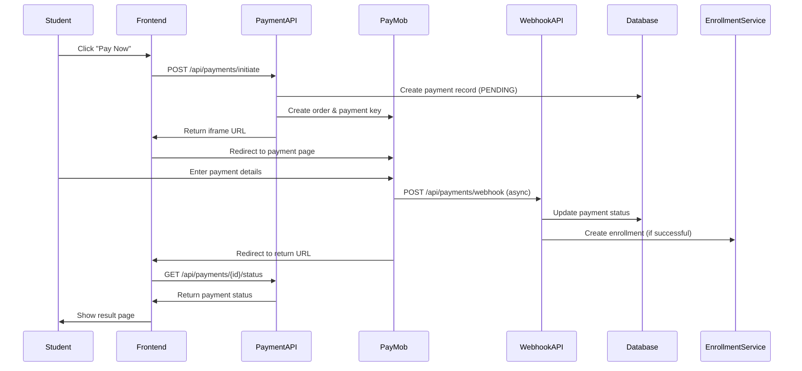

# PayMob Payment Completion Integration Design

## Overview

This design document outlines the implementation of a complete PayMob payment integration system that handles payment callbacks, verifies transactions, and automatically enrolls students in courses upon successful payment. The system will provide a seamless payment experience from initiation through completion.

## Architecture

### High-Level Flow



### System Components

1. **Payment Webhook Handler** - Processes PayMob callbacks
2. **Payment Status Checker** - Verifies payment status
3. **Return URL Handler** - Manages user redirects after payment
4. **Enrollment Service** - Handles automatic course enrollment
5. **Payment Dashboard** - Administrative interface for payment management

## Components and Interfaces

### 1. Payment Webhook API

**Endpoint:** `POST /api/payments/webhook`

```typescript
interface PayMobWebhookPayload {
  id: number;
  pending: boolean;
  amount_cents: number;
  success: boolean;
  is_auth: boolean;
  is_capture: boolean;
  is_refunded: boolean;
  is_voided: boolean;
  integration_id: number;
  order: {
    id: number;
    merchant_order_id: string;
    amount_cents: number;
    currency: string;
  };
  created_at: string;
  currency: string;
  error_occured: boolean;
  has_parent_transaction: boolean;
  is_3d_secure: boolean;
  is_standalone_payment: boolean;
  owner: number;
  source_data: {
    pan: string;
    type: string;
    sub_type: string;
  };
  hmac: string;
}

interface WebhookResponse {
  success: boolean;
  message: string;
  processed: boolean;
}
```

### 2. Payment Status API

**Endpoint:** `GET /api/payments/{id}/status`

```typescript
interface PaymentStatusResponse {
  paymentId: string;
  status: 'PENDING' | 'COMPLETED' | 'FAILED' | 'CANCELLED';
  amount: number;
  currency: string;
  paymobTransactionId?: number;
  completedAt?: string;
  failureReason?: string;
  course: {
    id: string;
    title: string;
    thumbnailUrl: string;
  };
  enrollment?: {
    id: string;
    enrolledAt: string;
  };
}
```

### 3. Payment Return URL Handler

**Endpoint:** `GET /courses/{courseId}/payment/result`

```typescript
interface PaymentResultPageProps {
  paymentId: string;
  status: 'success' | 'pending' | 'failed';
  transactionId?: string;
  course: CourseWithMetadata;
  enrollment?: Enrollment;
}
```

### 4. Enhanced Payment Service

```typescript
class PaymentService {
  // Webhook processing
  async processWebhook(payload: PayMobWebhookPayload): Promise<WebhookResponse>;
  
  // Payment verification
  async verifyPaymentStatus(paymentId: string): Promise<PaymentStatusResponse>;
  
  // Status checking
  async checkPaymentWithPayMob(paymobOrderId: string): Promise<PayMobTransactionResponse>;
  
  // Enrollment creation
  async createEnrollmentFromPayment(paymentId: string): Promise<Enrollment>;
  
  // Retry mechanisms
  async retryFailedWebhook(webhookId: string): Promise<boolean>;
}
```

### 5. Database Schema Updates

```sql
-- Add webhook tracking table
CREATE TABLE payment_webhooks (
  id VARCHAR(30) PRIMARY KEY,
  payment_id VARCHAR(30) NOT NULL,
  paymob_transaction_id BIGINT NOT NULL,
  webhook_payload JSONB NOT NULL,
  processed_at TIMESTAMP,
  processing_attempts INTEGER DEFAULT 0,
  last_error TEXT,
  created_at TIMESTAMP DEFAULT NOW(),
  FOREIGN KEY (payment_id) REFERENCES payments(id)
);

-- Add indexes for performance
CREATE INDEX idx_payment_webhooks_payment_id ON payment_webhooks(payment_id);
CREATE INDEX idx_payment_webhooks_transaction_id ON payment_webhooks(paymob_transaction_id);
CREATE INDEX idx_payments_paymob_order_id ON payments(paymob_order_id);

-- Update payments table
ALTER TABLE payments ADD COLUMN completed_at TIMESTAMP;
ALTER TABLE payments ADD COLUMN failure_reason TEXT;
ALTER TABLE payments ADD COLUMN paymob_transaction_id BIGINT;
```

## Data Models

### Enhanced Payment Model

```typescript
interface Payment {
  id: string;
  userId: string;
  courseId: string;
  amount: Decimal;
  currency: string;
  status: 'PENDING' | 'COMPLETED' | 'FAILED' | 'CANCELLED';
  paymobOrderId: string;
  paymobTransactionId?: number;
  paymobResponse?: any;
  completedAt?: Date;
  failureReason?: string;
  createdAt: Date;
  updatedAt: Date;
  
  // Relations
  user: User;
  course: Course;
  webhooks: PaymentWebhook[];
  enrollment?: Enrollment;
}
```

### Payment Webhook Model

```typescript
interface PaymentWebhook {
  id: string;
  paymentId: string;
  paymobTransactionId: number;
  webhookPayload: any;
  processedAt?: Date;
  processingAttempts: number;
  lastError?: string;
  createdAt: Date;
  
  // Relations
  payment: Payment;
}
```

## Error Handling

### Webhook Processing Errors

1. **Invalid Signature**
   - Log security incident
   - Return 401 Unauthorized
   - Alert administrators

2. **Payment Not Found**
   - Log warning with transaction details
   - Return 404 Not Found
   - Store webhook for manual review

3. **Database Errors**
   - Retry up to 3 times with exponential backoff
   - Queue for manual processing if all retries fail
   - Return 500 Internal Server Error

4. **Enrollment Creation Errors**
   - Mark payment as completed but enrollment as failed
   - Queue for manual enrollment
   - Notify student and administrators

### Return URL Handling

1. **Missing Payment ID**
   - Redirect to course catalog with error message
   - Log the incident for investigation

2. **Payment Status Mismatch**
   - Show current status from database
   - Provide refresh option
   - Offer contact support link

## Testing Strategy

### Unit Tests

1. **Webhook Signature Verification**
   - Test with valid PayMob signatures
   - Test with invalid signatures
   - Test with malformed payloads

2. **Payment Status Updates**
   - Test successful payment processing
   - Test failed payment handling
   - Test duplicate webhook handling

3. **Enrollment Creation**
   - Test successful enrollment creation
   - Test enrollment failure scenarios
   - Test duplicate enrollment prevention

### Integration Tests

1. **End-to-End Payment Flow**
   - Test complete payment journey
   - Test webhook processing
   - Test enrollment creation

2. **PayMob API Integration**
   - Test payment status queries
   - Test error handling
   - Test timeout scenarios

### Manual Testing Scenarios

1. **PayMob Test Environment**
   - Test successful payment with test cards
   - Test failed payment scenarios
   - Test 3D Secure authentication

2. **Webhook Simulation**
   - Test webhook processing with sample payloads
   - Test error scenarios
   - Test retry mechanisms

## Security Considerations

### Webhook Security

1. **HMAC Signature Verification**
   - Validate all incoming webhooks
   - Use constant-time comparison
   - Log invalid signature attempts

2. **Idempotency**
   - Prevent duplicate processing
   - Use transaction IDs for deduplication
   - Handle race conditions

3. **Rate Limiting**
   - Limit webhook processing rate
   - Implement backoff for failed attempts
   - Monitor for abuse patterns

### Data Protection

1. **Sensitive Data Handling**
   - Never log full card numbers
   - Encrypt stored payment data
   - Implement data retention policies

2. **Access Control**
   - Restrict webhook endpoint access
   - Implement proper authentication
   - Log all access attempts

## Performance Considerations

### Database Optimization

1. **Indexing Strategy**
   - Index payment lookup fields
   - Index webhook processing fields
   - Monitor query performance

2. **Connection Pooling**
   - Optimize database connections
   - Handle connection timeouts
   - Implement retry logic

### Webhook Processing

1. **Asynchronous Processing**
   - Process webhooks asynchronously
   - Queue heavy operations
   - Implement circuit breakers

2. **Caching Strategy**
   - Cache payment status
   - Cache course enrollment data
   - Implement cache invalidation

## Monitoring and Alerting

### Key Metrics

1. **Payment Success Rate**
   - Track successful vs failed payments
   - Monitor payment completion times
   - Alert on unusual patterns

2. **Webhook Processing**
   - Track webhook processing times
   - Monitor failed webhook attempts
   - Alert on processing failures

3. **Enrollment Success Rate**
   - Track automatic enrollment success
   - Monitor manual intervention needs
   - Alert on enrollment failures

### Logging Strategy

1. **Structured Logging**
   - Use consistent log formats
   - Include correlation IDs
   - Log all payment state changes

2. **Error Tracking**
   - Capture and track all errors
   - Include context information
   - Implement error aggregation

## Deployment Considerations

### Environment Configuration

1. **PayMob Settings**
   - Configure webhook URLs
   - Set up return URLs
   - Configure integration IDs

2. **Database Migrations**
   - Plan schema updates
   - Handle data migration
   - Test rollback procedures

### Rollout Strategy

1. **Feature Flags**
   - Enable webhook processing gradually
   - Test with subset of payments
   - Monitor system health

2. **Monitoring**
   - Enhanced monitoring during rollout
   - Quick rollback procedures
   - Performance baseline comparison