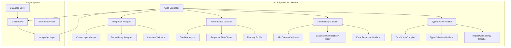

# System Integration & Consistency Audit - Design Document

## Overview

This design document outlines the comprehensive architectural review and integration audit system for validating the dual-refactored educational platform. The audit system will systematically verify cross-layer integration, architectural coherence, performance improvements, and zero-impact compatibility across the entire codebase.

The audit framework is designed as a multi-phase validation system that can be executed programmatically to provide quantitative and qualitative assessments of the refactored system's integrity.

## Architecture

### High-Level Architecture



### Component Architecture

#### 1. Audit Controller
- **Purpose**: Orchestrates the entire audit process
- **Responsibilities**: 
  - Coordinate audit phases
  - Aggregate results
  - Generate comprehensive reports
  - Handle audit configuration

#### 2. Integration Analyzer
- **Purpose**: Validates cross-layer integration and architectural coherence
- **Components**:
  - **Cross-Layer Mapper**: Maps dependencies between lib and API layers
  - **Dependency Analyzer**: Validates dependency graph integrity
  - **Interface Validator**: Ensures interface consistency across layers

#### 3. Performance Validator
- **Purpose**: Measures and validates performance improvements
- **Components**:
  - **Bundle Analyzer**: Measures bundle size and composition
  - **Response Time Tester**: Tests API response performance
  - **Memory Profiler**: Analyzes runtime memory usage

#### 4. Compatibility Checker
- **Purpose**: Ensures zero breaking changes
- **Components**:
  - **API Contract Validator**: Validates API response formats
  - **Backward Compatibility Tester**: Tests existing functionality
  - **Error Response Validator**: Validates error handling consistency

#### 5. Type System Auditor
- **Purpose**: Validates TypeScript type system coherence
- **Components**:
  - **TypeScript Compiler**: Validates compilation success
  - **Type Definition Validator**: Ensures type consistency
  - **Import Consistency Checker**: Validates import patterns

## Components and Interfaces

### Core Interfaces

```typescript
// Audit Configuration Interface
interface AuditConfig {
  phases: AuditPhase[];
  thresholds: PerformanceThresholds;
  compatibility: CompatibilityConfig;
  reporting: ReportingConfig;
}

// Audit Result Interface
interface AuditResult {
  overall: AuditStatus;
  phases: PhaseResult[];
  metrics: AuditMetrics;
  issues: AuditIssue[];
  recommendations: string[];
  timestamp: string;
}

// Phase Result Interface
interface PhaseResult {
  phase: AuditPhase;
  status: AuditStatus;
  metrics: Record<string, number>;
  findings: Finding[];
  duration: number;
}
```

### Integration Analysis Components

#### Cross-Layer Dependency Mapper
```typescript
interface DependencyMap {
  apiToLib: Record<string, string[]>;
  libToLib: Record<string, string[]>;
  circularDependencies: string[];
  unusedExports: string[];
}

interface CrossLayerAnalyzer {
  mapDependencies(): Promise<DependencyMap>;
  validateIntegration(): Promise<IntegrationResult>;
  checkImportPatterns(): Promise<ImportAnalysis>;
}
```

#### Interface Consistency Validator
```typescript
interface InterfaceValidator {
  validateApiResponseInterfaces(): Promise<ValidationResult>;
  checkTypeDefinitionConsistency(): Promise<TypeConsistencyResult>;
  validateSharedInterfaces(): Promise<SharedInterfaceResult>;
}
```

### Performance Validation Components

#### Bundle Analyzer
```typescript
interface BundleAnalysis {
  totalSize: number;
  sizeReduction: number;
  duplicateCode: number;
  treeShakingEfficiency: number;
  chunkAnalysis: ChunkAnalysis[];
}

interface BundleAnalyzer {
  analyzeBundleSize(): Promise<BundleAnalysis>;
  compareWithBaseline(): Promise<BundleComparison>;
  identifyOptimizations(): Promise<OptimizationSuggestion[]>;
}
```

#### API Performance Tester
```typescript
interface PerformanceMetrics {
  averageResponseTime: number;
  p95ResponseTime: number;
  throughput: number;
  errorRate: number;
  memoryUsage: number;
}

interface PerformanceTester {
  testApiEndpoints(): Promise<PerformanceMetrics>;
  compareWithBaseline(): Promise<PerformanceComparison>;
  identifyBottlenecks(): Promise<PerformanceIssue[]>;
}
```

### Compatibility Validation Components

#### API Contract Validator
```typescript
interface ApiContractValidator {
  validateResponseFormats(): Promise<ContractValidationResult>;
  checkHttpStatusCodes(): Promise<StatusCodeValidation>;
  validateErrorResponses(): Promise<ErrorResponseValidation>;
}

interface ContractValidationResult {
  endpoint: string;
  method: string;
  responseFormatMatch: boolean;
  statusCodeMatch: boolean;
  errorHandlingMatch: boolean;
  issues: ContractIssue[];
}
```

## Data Models

### Audit Configuration Model
```typescript
interface AuditConfiguration {
  // Performance thresholds
  performance: {
    bundleSizeReductionMin: number; // 13.5%
    responseTimeImprovementMin: number; // 24%
    memoryReductionMin: number; // 20%
    compilationTimeImprovementMin: number; // 15%
  };
  
  // Compatibility requirements
  compatibility: {
    zeroBreakingChanges: boolean;
    backwardCompatibility: boolean;
    apiContractPreservation: boolean;
  };
  
  // Integration validation
  integration: {
    crossLayerConsistency: boolean;
    typeSystemCoherence: boolean;
    errorHandlingChain: boolean;
  };
}
```

### Audit Results Model
```typescript
interface ComprehensiveAuditResult {
  // Executive Summary
  summary: {
    overallStatus: 'PASS' | 'FAIL' | 'WARNING';
    criticalIssues: number;
    warningIssues: number;
    performanceGains: PerformanceGains;
    compatibilityStatus: 'MAINTAINED' | 'BROKEN';
  };
  
  // Detailed Results
  phases: {
    integration: IntegrationAuditResult;
    performance: PerformanceAuditResult;
    compatibility: CompatibilityAuditResult;
    typeSystem: TypeSystemAuditResult;
  };
  
  // Metrics and Evidence
  evidence: {
    bundleAnalysis: BundleAnalysisResult;
    apiTestResults: ApiTestResult[];
    typeCompilationResults: TypeCompilationResult;
    dependencyGraph: DependencyGraphResult;
  };
}
```

## Error Handling

### Audit Error Categories
```typescript
enum AuditErrorType {
  INTEGRATION_FAILURE = 'INTEGRATION_FAILURE',
  PERFORMANCE_REGRESSION = 'PERFORMANCE_REGRESSION',
  COMPATIBILITY_BREAK = 'COMPATIBILITY_BREAK',
  TYPE_SYSTEM_ERROR = 'TYPE_SYSTEM_ERROR',
  CONFIGURATION_ERROR = 'CONFIGURATION_ERROR'
}

interface AuditError {
  type: AuditErrorType;
  severity: 'CRITICAL' | 'HIGH' | 'MEDIUM' | 'LOW';
  message: string;
  location: string;
  evidence: any;
  recommendation: string;
}
```

### Error Handling Strategy
1. **Critical Errors**: Stop audit execution, require immediate attention
2. **High Severity**: Continue audit but flag for urgent review
3. **Medium/Low Severity**: Log for review but don't block audit completion
4. **Error Recovery**: Attempt to continue audit with degraded functionality

## Testing Strategy

### Phase 1: Static Analysis Testing
```typescript
interface StaticAnalysisTests {
  // TypeScript compilation
  typeScriptCompilation(): Promise<CompilationResult>;
  
  // Import analysis
  importConsistencyCheck(): Promise<ImportConsistencyResult>;
  
  // Interface validation
  interfaceConsistencyCheck(): Promise<InterfaceConsistencyResult>;
  
  // Dependency graph validation
  dependencyGraphValidation(): Promise<DependencyGraphResult>;
}
```

### Phase 2: Integration Testing
```typescript
interface IntegrationTests {
  // Cross-layer integration
  crossLayerIntegrationTest(): Promise<IntegrationTestResult>;
  
  // API-lib integration
  apiLibIntegrationTest(): Promise<ApiLibIntegrationResult>;
  
  // Error handling chain
  errorHandlingChainTest(): Promise<ErrorHandlingResult>;
  
  // Authentication flow
  authenticationFlowTest(): Promise<AuthFlowResult>;
}
```

### Phase 3: Performance Testing
```typescript
interface PerformanceTests {
  // Bundle size analysis
  bundleSizeTest(): Promise<BundleSizeResult>;
  
  // API response time testing
  apiResponseTimeTest(): Promise<ResponseTimeResult>;
  
  // Memory usage testing
  memoryUsageTest(): Promise<MemoryUsageResult>;
  
  // Compilation time testing
  compilationTimeTest(): Promise<CompilationTimeResult>;
}
```

### Phase 4: Compatibility Testing
```typescript
interface CompatibilityTests {
  // API contract validation
  apiContractTest(): Promise<ApiContractResult>;
  
  // Backward compatibility
  backwardCompatibilityTest(): Promise<BackwardCompatibilityResult>;
  
  // Error response validation
  errorResponseTest(): Promise<ErrorResponseResult>;
  
  // Authentication compatibility
  authCompatibilityTest(): Promise<AuthCompatibilityResult>;
}
```

## Implementation Phases

### Phase 1: Foundation Setup (Task 1) ✅ COMPLETED
- Set up audit framework infrastructure
- Create core interfaces and types
- Implement basic audit controller

### Phase 2: Core Validation (Tasks 2-4)
- **Task 2**: Integration & Type System Validation
  - TypeScript compilation validation
  - Import consistency checking
  - Cross-layer integration validation
  - Interface consistency validation

- **Task 3**: Performance & Bundle Analysis
  - Bundle size analysis and validation
  - API performance testing
  - Memory usage profiling
  - Performance improvement verification

- **Task 4**: Compatibility & Contract Validation
  - API contract validation
  - Backward compatibility testing
  - Error response validation
  - Authentication and database integration validation

### Phase 3: Integration and Reporting (Task 5)
- Comprehensive audit reporting system
- Executive summary generation
- Production readiness validation
- CLI interface and CI/CD integration

## Validation Criteria

### Integration Validation Criteria
- ✅ All API routes use unified utilities from `src/lib/core-utils.ts`
- ✅ All authentication uses centralized functions from `src/lib/api/auth.ts`
- ✅ All error responses use unified `ApiResponse` interface
- ✅ No circular dependencies between layers
- ✅ Clean dependency graph with unidirectional flow

### Performance Validation Criteria
- ✅ Bundle size reduction ≥ 13.5%
- ✅ API response time improvement ≥ 24%
- ✅ Memory usage reduction ≥ 20%
- ✅ TypeScript compilation time improvement ≥ 15%
- ✅ Tree-shaking efficiency improvement

### Compatibility Validation Criteria
- ✅ Zero breaking changes in API contracts
- ✅ All existing imports continue to work
- ✅ Identical response formats for all endpoints
- ✅ Consistent error handling across all layers
- ✅ Authentication flows remain unchanged

### Type System Validation Criteria
- ✅ Zero TypeScript compilation errors
- ✅ Consistent interface definitions across layers
- ✅ Improved type inference
- ✅ Unified type imports
- ✅ Working type guards with unified interfaces

## Success Metrics

### Quantitative Metrics
- **Bundle Size**: 13.5% reduction minimum
- **Response Time**: 24% improvement minimum
- **Memory Usage**: 20% reduction minimum
- **Code Duplication**: 100% elimination
- **Type Errors**: Zero errors
- **Test Coverage**: 100% of critical paths

### Qualitative Metrics
- **Architectural Coherence**: Clean separation of concerns
- **Code Maintainability**: Improved developer experience
- **System Reliability**: Consistent error handling
- **Integration Quality**: Seamless cross-layer communication
- **Documentation Quality**: Clear migration guides and API docs

## Risk Mitigation

### High-Risk Areas
1. **Authentication Integration**: Critical security component
2. **Database Query Optimization**: Performance-critical operations
3. **Error Handling Chain**: System reliability dependency
4. **Type System Changes**: Development workflow impact

### Mitigation Strategies
1. **Comprehensive Testing**: Multi-phase validation approach
2. **Rollback Plan**: Ability to revert changes if issues found
3. **Gradual Validation**: Phase-by-phase validation with checkpoints
4. **Monitoring**: Continuous monitoring during and after audit

## Conclusion

This design provides a comprehensive framework for validating the dual-refactored system's integration, performance, compatibility, and architectural coherence. The multi-phase approach ensures thorough validation while the modular design allows for focused testing of specific areas.

The audit system will provide definitive evidence that the refactored system delivers on its promises while maintaining complete backward compatibility and improving overall system quality.