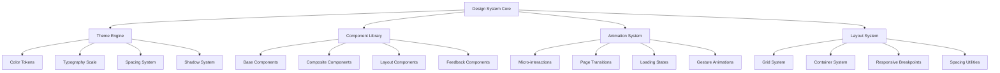
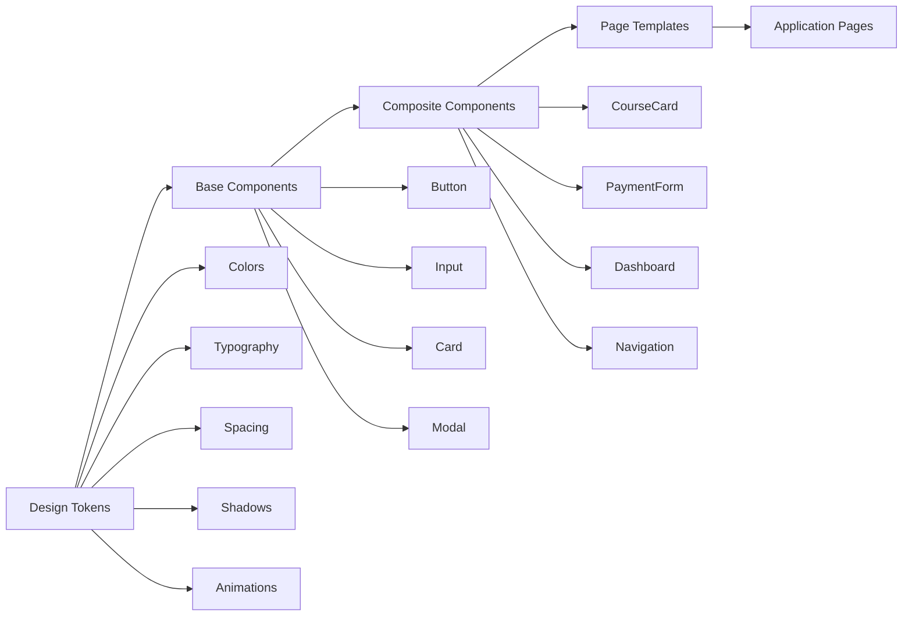

# UI/UX Modernization Design Document

## Overview

This design document outlines the comprehensive modernization of the Arabic-first course selling platform's user interface and user experience. Based on detailed analysis of the current codebase (384 TypeScript files, Next.js 15.4.5, React 19.1.1, Shadcn/UI) and inspiration from modern platforms like peec.ai, promptwatch.com, klasio.com, and khaled-sakr.com, this design creates a premium educational experience.

The design focuses on transforming basic Shadcn components into premium interactive elements with 3D effects, implementing gamification systems, creating enterprise-grade admin dashboards, and building a mobile-first PWA experience that generates significant revenue through enhanced user engagement.

## Architecture

### Design System Architecture



### Component Hierarchy



## Components and Interfaces

### 1. Enhanced Design System

#### Advanced Color System with 50+ Semantic Colors
```typescript
// Premium educational platform color system
const colorSystem = {
  // Primary Brand Colors (Emerald-based for education)
  primary: {
    50: '#ecfdf5',   // Ultra light emerald
    100: '#d1fae5',  // Very light emerald
    200: '#a7f3d0',  // Light emerald
    300: '#6ee7b7',  // Medium light emerald
    400: '#34d399',  // Medium emerald
    500: '#10b981',  // Primary emerald (main brand)
    600: '#059669',  // Dark emerald
    700: '#047857',  // Darker emerald
    800: '#065f46',  // Very dark emerald
    900: '#064e3b',  // Darkest emerald
    950: '#022c22',  // Ultra dark emerald
  },
  
  // Secondary Colors (Amber for highlights)
  secondary: {
    50: '#fffbeb',   // Ultra light amber
    100: '#fef3c7',  // Very light amber
    200: '#fde68a',  // Light amber
    300: '#fcd34d',  // Medium light amber
    400: '#fbbf24',  // Medium amber
    500: '#f59e0b',  // Primary amber
    600: '#d97706',  // Dark amber
    700: '#b45309',  // Darker amber
    800: '#92400e',  // Very dark amber
    900: '#78350f',  // Darkest amber
  },
  
  // Semantic Colors with Arabic cultural considerations
  success: {
    light: '#10b981',
    DEFAULT: '#059669',
    dark: '#047857',
  },
  warning: {
    light: '#f59e0b',
    DEFAULT: '#d97706',
    dark: '#b45309',
  },
  error: {
    light: '#ef4444',
    DEFAULT: '#dc2626',
    dark: '#b91c1c',
  },
  info: {
    light: '#3b82f6',
    DEFAULT: '#2563eb',
    dark: '#1d4ed8',
  },
  
  // Gradient System (20+ predefined gradients)
  gradients: {
    primary: 'linear-gradient(135deg, #10b981 0%, #059669 100%)',
    secondary: 'linear-gradient(135deg, #f59e0b 0%, #d97706 100%)',
    hero: 'linear-gradient(135deg, #10b981 0%, #3b82f6 50%, #8b5cf6 100%)',
    glass: 'linear-gradient(135deg, rgba(255,255,255,0.1) 0%, rgba(255,255,255,0.05) 100%)',
    mesh: 'radial-gradient(circle at 20% 80%, #10b981 0%, transparent 50%), radial-gradient(circle at 80% 20%, #3b82f6 0%, transparent 50%)',
  },
  
  // Glass Morphism Colors
  glass: {
    light: 'rgba(255, 255, 255, 0.1)',
    medium: 'rgba(255, 255, 255, 0.15)',
    dark: 'rgba(0, 0, 0, 0.1)',
  },
  
  // Arabic-optimized neutral grays
  neutral: {
    50: '#fafafa',   // Ultra light gray
    100: '#f5f5f5',  // Very light gray
    200: '#e5e5e5',  // Light gray
    300: '#d4d4d4',  // Medium light gray
    400: '#a3a3a3',  // Medium gray
    500: '#737373',  // Primary gray
    600: '#525252',  // Dark gray
    700: '#404040',  // Darker gray
    800: '#262626',  // Very dark gray
    900: '#171717',  // Darkest gray
    950: '#0a0a0a',  // Ultra dark gray
  }
}
```

#### Premium Arabic Typography System
```typescript
const arabicTypographySystem = {
  fontFamily: {
    // Primary font for body text (excellent Arabic support)
    primary: ['Tajawal', 'system-ui', '-apple-system', 'sans-serif'],
    
    // Display font for headings (modern Arabic design)
    display: ['Cairo', 'Tajawal', 'system-ui', 'sans-serif'],
    
    // Monospace font for code (Arabic-compatible)
    mono: ['IBM Plex Sans Arabic', 'Courier New', 'monospace'],
    
    // Fallback system fonts
    system: ['system-ui', '-apple-system', 'BlinkMacSystemFont', 'Segoe UI', 'sans-serif'],
  },
  
  // Fluid typography scale optimized for Arabic text
  fontSize: {
    xs: ['0.75rem', { lineHeight: '1.2rem' }],      // 12px - Arabic optimized
    sm: ['0.875rem', { lineHeight: '1.4rem' }],     // 14px - Arabic optimized
    base: ['1rem', { lineHeight: '1.6rem' }],       // 16px - Arabic optimized
    lg: ['1.125rem', { lineHeight: '1.8rem' }],     // 18px - Arabic optimized
    xl: ['1.25rem', { lineHeight: '2rem' }],        // 20px - Arabic optimized
    '2xl': ['1.5rem', { lineHeight: '2.2rem' }],    // 24px - Arabic optimized
    '3xl': ['1.875rem', { lineHeight: '2.6rem' }],  // 30px - Arabic optimized
    '4xl': ['2.25rem', { lineHeight: '3rem' }],     // 36px - Arabic optimized
    '5xl': ['3rem', { lineHeight: '3.6rem' }],      // 48px - Arabic optimized
    '6xl': ['3.75rem', { lineHeight: '4.2rem' }],   // 60px - Arabic optimized
    '7xl': ['4.5rem', { lineHeight: '5rem' }],      // 72px - Arabic optimized
    '8xl': ['6rem', { lineHeight: '6.5rem' }],      // 96px - Arabic optimized
    '9xl': ['8rem', { lineHeight: '8.5rem' }],      // 128px - Arabic optimized
  },
  
  // Font weights optimized for Arabic readability
  fontWeight: {
    thin: '200',      // Tajawal 200
    light: '300',     // Tajawal 300
    normal: '400',    // Tajawal 400 (primary)
    medium: '500',    // Tajawal 500
    semibold: '600',  // Cairo 600 (headings)
    bold: '700',      // Cairo 700 (headings)
    extrabold: '800', // Cairo 800 (display)
    black: '900',     // Cairo 900 (display)
  },
  
  // Arabic-specific line heights
  lineHeight: {
    'arabic-tight': '1.4',    // For headings
    'arabic-normal': '1.6',   // For body text
    'arabic-relaxed': '1.8',  // For long-form content
    'arabic-loose': '2.0',    // For captions
  },
  
  // Letter spacing for Arabic (minimal adjustments)
  letterSpacing: {
    'arabic-tight': '-0.01em',
    'arabic-normal': '0em',
    'arabic-wide': '0.01em',
  },
  
  // Font loading optimization
  fontDisplay: 'swap',
  fontOptimization: {
    preload: ['Tajawal-400', 'Cairo-600', 'Cairo-700'],
    fallback: 'system-ui',
    adjustPeriod: '100ms',
  }
}
```

### 2. Advanced Component Library

#### Modern Button Component
```typescript
interface ModernButtonProps {
  variant: 'primary' | 'secondary' | 'outline' | 'ghost' | 'gradient';
  size: 'xs' | 'sm' | 'md' | 'lg' | 'xl';
  loading?: boolean;
  success?: boolean;
  error?: boolean;
  icon?: React.ReactNode;
  iconPosition?: 'left' | 'right';
  fullWidth?: boolean;
  rounded?: 'none' | 'sm' | 'md' | 'lg' | 'full';
  shadow?: 'none' | 'sm' | 'md' | 'lg' | 'xl';
  animation?: 'none' | 'pulse' | 'bounce' | 'shake';
}
```

#### Enhanced Card Component
```typescript
interface ModernCardProps {
  variant: 'default' | 'elevated' | 'outlined' | 'glass' | 'gradient';
  hover?: 'none' | 'lift' | 'glow' | 'scale' | 'tilt';
  padding: 'none' | 'sm' | 'md' | 'lg' | 'xl';
  rounded: 'none' | 'sm' | 'md' | 'lg' | 'xl' | '2xl';
  shadow: 'none' | 'sm' | 'md' | 'lg' | 'xl' | '2xl';
  border?: boolean;
  backdrop?: boolean;
  interactive?: boolean;
}
```

#### Smart Form Components
```typescript
interface SmartInputProps {
  variant: 'default' | 'floating' | 'filled' | 'underlined';
  validation: 'none' | 'realtime' | 'onBlur' | 'onSubmit';
  feedback: 'none' | 'icon' | 'text' | 'both';
  animation: 'none' | 'smooth' | 'spring' | 'bounce';
  autoComplete?: boolean;
  suggestions?: string[];
  mask?: string;
  formatter?: (value: string) => string;
}
```

### 3. Animation System

#### Micro-interactions
```typescript
const animations = {
  // Button interactions
  buttonPress: {
    scale: 0.95,
    transition: { duration: 0.1 }
  },
  
  buttonHover: {
    scale: 1.02,
    boxShadow: '0 10px 25px rgba(0,0,0,0.1)',
    transition: { duration: 0.2 }
  },
  
  // Card interactions
  cardHover: {
    y: -8,
    boxShadow: '0 25px 50px rgba(0,0,0,0.15)',
    transition: { duration: 0.3 }
  },
  
  // Page transitions
  pageEnter: {
    opacity: 1,
    y: 0,
    transition: { duration: 0.4, ease: 'easeOut' }
  },
  
  pageExit: {
    opacity: 0,
    y: -20,
    transition: { duration: 0.3, ease: 'easeIn' }
  },
  
  // Loading states
  skeleton: {
    opacity: [0.5, 1, 0.5],
    transition: { duration: 1.5, repeat: Infinity }
  },
  
  // Success feedback
  success: {
    scale: [1, 1.1, 1],
    transition: { duration: 0.6 }
  }
}
```

### 4. Responsive Layout System

#### Breakpoint System
```typescript
const breakpoints = {
  xs: '475px',    // Mobile small
  sm: '640px',    // Mobile large
  md: '768px',    // Tablet
  lg: '1024px',   // Desktop small
  xl: '1280px',   // Desktop large
  '2xl': '1536px' // Desktop extra large
}
```

#### Grid System
```typescript
const gridSystem = {
  container: {
    center: true,
    padding: {
      DEFAULT: '1rem',
      sm: '2rem',
      lg: '4rem',
      xl: '5rem',
      '2xl': '6rem',
    },
    screens: {
      sm: '640px',
      md: '768px',
      lg: '1024px',
      xl: '1280px',
      '2xl': '1536px',
    }
  }
}
```

## Data Models

### Theme Configuration
```typescript
interface ThemeConfig {
  mode: 'light' | 'dark' | 'auto';
  primaryColor: string;
  secondaryColor: string;
  borderRadius: 'none' | 'sm' | 'md' | 'lg' | 'xl';
  animations: boolean;
  reducedMotion: boolean;
  highContrast: boolean;
  fontSize: 'sm' | 'md' | 'lg' | 'xl';
}
```

### Component State Management
```typescript
interface ComponentState {
  loading: boolean;
  error: string | null;
  success: boolean;
  disabled: boolean;
  focused: boolean;
  hovered: boolean;
  pressed: boolean;
  validated: boolean;
}
```

### Animation State
```typescript
interface AnimationState {
  isAnimating: boolean;
  currentAnimation: string | null;
  queue: Animation[];
  preferences: {
    reducedMotion: boolean;
    duration: number;
    easing: string;
  };
}
```

## Error Handling

### User-Friendly Error States
```typescript
interface ErrorHandling {
  // Form validation errors
  validation: {
    display: 'inline' | 'tooltip' | 'modal';
    animation: 'shake' | 'highlight' | 'pulse';
    persistence: 'temporary' | 'until-fixed';
  };
  
  // Network errors
  network: {
    retry: boolean;
    fallback: 'cache' | 'offline-mode' | 'placeholder';
    notification: 'toast' | 'banner' | 'modal';
  };
  
  // Loading errors
  loading: {
    timeout: number;
    fallback: 'skeleton' | 'placeholder' | 'error-state';
    recovery: 'auto-retry' | 'manual-retry' | 'redirect';
  };
}
```

### Graceful Degradation
```typescript
interface GracefulDegradation {
  // Animation fallbacks
  animations: {
    reducedMotion: 'disable' | 'reduce' | 'essential-only';
    lowPerformance: 'simple' | 'css-only' | 'none';
  };
  
  // Image fallbacks
  images: {
    loading: 'lazy' | 'eager' | 'progressive';
    fallback: 'placeholder' | 'blur' | 'skeleton';
    error: 'retry' | 'placeholder' | 'hide';
  };
  
  // JavaScript fallbacks
  javascript: {
    disabled: 'progressive-enhancement';
    error: 'graceful-fallback';
  };
}
```

## Testing Strategy

### Visual Regression Testing
```typescript
interface VisualTesting {
  // Component testing
  components: {
    states: ['default', 'hover', 'focus', 'disabled', 'error'];
    themes: ['light', 'dark', 'high-contrast'];
    sizes: ['mobile', 'tablet', 'desktop'];
  };
  
  // Page testing
  pages: {
    breakpoints: ['320px', '768px', '1024px', '1440px'];
    interactions: ['scroll', 'hover', 'click', 'keyboard'];
    loading: ['initial', 'skeleton', 'error', 'success'];
  };
}
```

### Performance Testing
```typescript
interface PerformanceTesting {
  // Core Web Vitals
  metrics: {
    LCP: '< 2.5s';  // Largest Contentful Paint
    FID: '< 100ms'; // First Input Delay
    CLS: '< 0.1';   // Cumulative Layout Shift
  };
  
  // Animation performance
  animations: {
    fps: '60fps';
    jank: '< 5%';
    memory: 'stable';
  };
  
  // Bundle size
  bundles: {
    initial: '< 200KB';
    chunks: '< 50KB';
    images: 'optimized';
  };
}
```

### Accessibility Testing
```typescript
interface AccessibilityTesting {
  // WCAG compliance
  wcag: {
    level: 'AA';
    contrast: '4.5:1';
    keyboard: 'full-navigation';
    screenReader: 'compatible';
  };
  
  // User testing
  users: {
    screenReaders: ['NVDA', 'JAWS', 'VoiceOver'];
    keyboards: ['tab', 'arrow', 'enter', 'space'];
    magnification: ['200%', '400%'];
  };
}
```

## Implementation Architecture

### File Structure
```
src/
├── design-system/
│   ├── tokens/
│   │   ├── colors.ts
│   │   ├── typography.ts
│   │   ├── spacing.ts
│   │   └── animations.ts
│   ├── components/
│   │   ├── base/
│   │   │   ├── Button/
│   │   │   ├── Input/
│   │   │   ├── Card/
│   │   │   └── Modal/
│   │   ├── composite/
│   │   │   ├── CourseCard/
│   │   │   ├── PaymentForm/
│   │   │   └── Dashboard/
│   │   └── layout/
│   │       ├── Container/
│   │       ├── Grid/
│   │       └── Stack/
│   ├── hooks/
│   │   ├── useTheme.ts
│   │   ├── useAnimation.ts
│   │   └── useResponsive.ts
│   └── utils/
│       ├── animations.ts
│       ├── responsive.ts
│       └── accessibility.ts
├── components/
│   ├── modernized/
│   │   ├── navigation/
│   │   ├── course/
│   │   ├── payment/
│   │   ├── admin/
│   │   └── student/
│   └── legacy/ (for gradual migration)
└── styles/
    ├── globals.css
    ├── components.css
    └── animations.css
```

### Technology Stack
```typescript
interface TechStack {
  // Core frameworks
  ui: 'React 18' | 'Next.js 14';
  styling: 'Tailwind CSS' | 'CSS-in-JS';
  animations: 'Framer Motion' | 'React Spring';
  
  // Component library
  base: 'Radix UI' | 'Headless UI';
  icons: 'Lucide React' | 'Heroicons';
  
  // Development tools
  storybook: 'Component documentation';
  testing: 'Jest + React Testing Library';
  visual: 'Chromatic' | 'Percy';
  
  // Performance
  bundling: 'Next.js built-in';
  images: 'Next.js Image optimization';
  fonts: 'Next.js Font optimization';
}
```

### Migration Strategy
```typescript
interface MigrationStrategy {
  // Phase 1: Foundation
  phase1: {
    duration: '1-2 weeks';
    scope: ['Design tokens', 'Base components', 'Theme system'];
    risk: 'Low';
  };
  
  // Phase 2: Core Components
  phase2: {
    duration: '2-3 weeks';
    scope: ['Navigation', 'Cards', 'Forms', 'Buttons'];
    risk: 'Medium';
  };
  
  // Phase 3: Complex Components
  phase3: {
    duration: '3-4 weeks';
    scope: ['Course pages', 'Payment flow', 'Admin dashboard'];
    risk: 'High';
  };
  
  // Phase 4: Polish & Optimization
  phase4: {
    duration: '1-2 weeks';
    scope: ['Animations', 'Performance', 'Accessibility'];
    risk: 'Low';
  };
}
```

## Key Design Decisions

### 1. Component Architecture
- **Atomic Design**: Base components → Composite components → Page templates
- **Composition over Inheritance**: Flexible, reusable component patterns
- **Props-based Variants**: Type-safe component variations
- **Compound Components**: Complex components with multiple parts

### 2. Animation Philosophy
- **Purposeful Motion**: Every animation serves a functional purpose
- **Performance First**: 60fps animations with GPU acceleration
- **Accessibility Aware**: Respects `prefers-reduced-motion`
- **Progressive Enhancement**: Works without JavaScript

### 3. Responsive Strategy
- **Mobile First**: Design and develop for mobile, enhance for desktop
- **Container Queries**: Component-level responsive design
- **Fluid Typography**: Scales smoothly across screen sizes
- **Touch Optimization**: Appropriate touch targets and gestures

### 4. Performance Optimization
- **Code Splitting**: Lazy load components and routes
- **Image Optimization**: WebP, AVIF, responsive images
- **Bundle Analysis**: Monitor and optimize bundle sizes
- **Critical CSS**: Inline critical styles, defer non-critical

### 5. Accessibility Standards
- **WCAG 2.1 AA**: Full compliance with accessibility guidelines
- **Semantic HTML**: Proper markup structure
- **Keyboard Navigation**: Full keyboard accessibility
- **Screen Reader Support**: Comprehensive ARIA implementation